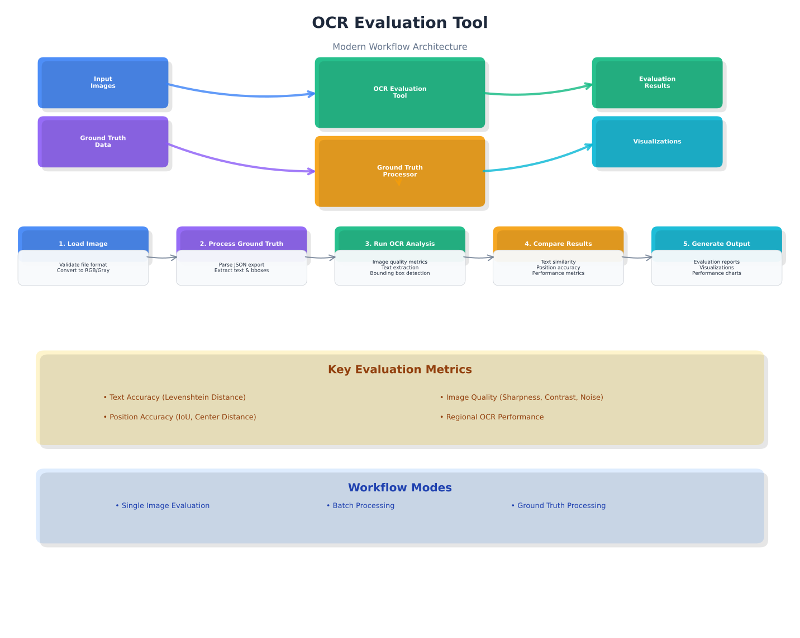

# OCR Image Quality Evaluation Tool

A comprehensive tool for evaluating image quality metrics that are crucial for Optical Character Recognition (OCR) performance. This tool provides both command-line and graphical interfaces for analyzing image quality, performing OCR detection, and comparing results against ground truth data.

## 🚀 Quick Start

### GUI (Recommended)

```bash
python ocr_gui.py
```

### Command Line

```bash
python ocr_evaluation_tool.py path/to/your/image.jpg
```

## ✨ Key Features

### Enhanced OCR Detection Workflow

- **Full Image OCR Analysis**: Detects all text regions with bounding boxes
- **OCR Detection Maps**: Creates `OCR_detected_map.json` with text, coordinates, and confidence scores
- **Ground Truth Comparison**: Compares detected regions against ground truth data
- **Comprehensive Visualizations**: Multiple visualization types for detailed analysis

### Modern Graphical User Interface

- **PySide6-based GUI**: Cross-platform interface with system theme support
- **Three Main Modes**:
  - **OCR Evaluation**: Single image analysis with ground truth comparison
  - **Batch OCR Evaluation**: Process multiple images with aggregate metrics
  - **Ground Truth Processor**: Convert Label Studio exports to ground truth maps
- **Smart Validation**: Automatic file validation and error handling
- **Organized Output**: Results automatically saved in timestamped folders

### Advanced Metrics & Analysis

- **Image Quality Metrics**: Laplacian variance, contrast, noise estimation, SSIM
- **OCR Performance Metrics**: Character/word accuracy, precision, recall, F1 scores
- **Regional Analysis**: Bounding box detection and comparison
- **Histogram Analysis**: Distribution analysis of all metrics
- **GPU Acceleration**: CUDA support for faster processing

## 🔄 Workflow Overview

The OCR Evaluation Tool follows a comprehensive workflow designed to provide detailed analysis of image quality and OCR performance:



### Workflow Steps

1. **Image Input**: The tool accepts various image formats (JPEG, PNG, BMP, TIFF)
2. **Preprocessing**: Automatic image enhancement and quality assessment
3. **OCR Detection**: Text region detection with bounding boxes and confidence scores
4. **Ground Truth Comparison**: Comparison against provided ground truth data
5. **Metrics Calculation**: Comprehensive quality and performance metrics
6. **Visualization**: Multiple visualization types for detailed analysis
7. **Results Export**: Structured output in JSON format with visualizations

### Processing Modes

- **Single Image Evaluation**: Detailed analysis of individual images
- **Batch Processing**: Efficient processing of multiple images with aggregate metrics
- **Ground Truth Processing**: Conversion of Label Studio exports to ground truth maps

## 📋 Requirements

### Dependencies

```bash
pip install -r requirements.txt
```

**Core Dependencies:**

- `opencv-python>=4.5.0` - Image processing and computer vision
- `numpy<2` - Numerical computations
- `scikit-image>=0.18.0` - Image analysis and metrics
- `matplotlib>=3.5.0` - Visualization
- `Pillow>=8.3.0` - Image handling
- `PySide6<6.7` - GUI framework
- `typing_extensions>=4.5.0` - Type hints support

**OCR & ML Dependencies:**

- `torch>=1.9.0` - PyTorch for GPU acceleration
- `torchvision>=0.10.0` - Computer vision models
- `pytesseract>=0.3.10` - Tesseract OCR engine
- `easyocr>=1.7.0` - EasyOCR for text detection

### System Requirements

- **Python**: 3.8 or higher
- **GPU**: Optional but recommended for faster processing (CUDA support)
- **Tesseract**: Required for OCR functionality (install separately)

## 🎯 Usage

### Graphical User Interface

#### Launch the GUI

```bash
python ocr_gui.py
```

#### OCR Evaluation Mode

1. Select "OCR Evaluation" from the dropdown
2. Choose an image file
3. Select a ground truth map (JSON format)
4. Click "Evaluate" to run analysis
5. Results are saved in `Evaluation/Run_<timestamp>/`:
   - `OCR_detected_map.json` - All detected text regions
   - `ground_truth_ocr_comparison.json` - Comparison results
   - `evaluation_<timestamp>.json` - Evaluation metrics
   - `evaluation_visualization_<timestamp>.png` - Metrics visualization
   - `bbox_visualization_<timestamp>.png` - Bounding box visualization
   - `histogram_analysis_<timestamp>.png` - Histogram analysis

#### Batch OCR Evaluation Mode

1. Select "Batch OCR Evaluation" from the dropdown
2. Choose a folder containing multiple images
3. Select a ground truth map (JSON format)
4. Click "Evaluate Batch" to process a random sample of 10 images
5. Results are saved in `Evaluation/Batch_Run_<timestamp>/`:
   - `batch_evaluation_<timestamp>.json` - Aggregate results
   - `batch_evaluation_visualization_<timestamp>.png` - Comprehensive visualization
   - Individual image results in subdirectories

#### Ground Truth Processor Mode

1. Select "Ground Truth Processor" from the dropdown
2. Choose a Label Studio export JSON file
3. Click "Process" to create `Ground_Truth_Maps/ground_truth_map.json`

### Command Line Interface

#### Basic Usage

```bash
# Single image evaluation
python ocr_evaluation_tool.py path/to/your/image.jpg

# Save results to JSON file
python ocr_evaluation_tool.py path/to/your/image.jpg --output results.json

# Create visualization
python ocr_evaluation_tool.py path/to/your/image.jpg --visualization analysis.png

# Both save results and create visualization
python ocr_evaluation_tool.py path/to/your/image.jpg -o results.json -v analysis.png

# Evaluate with ground truth text
python ocr_evaluation_tool.py path/to/your/image.jpg --ground-truth "expected text here"

# Run without displaying results (batch processing)
python ocr_evaluation_tool.py path/to/your/image.jpg --no-display
```

#### Advanced Options

```bash
# Set matching mode for ground truth comparison
python ocr_evaluation_tool.py image.jpg --matching-mode text_aware

# Set Levenshtein threshold
python ocr_evaluation_tool.py image.jpg --levenshtein-threshold 2

# Enable debug output
python ocr_evaluation_tool.py image.jpg --debug
```

### Python API

```python
from ocr_evaluation_tool import OCREvaluationTool

# Create evaluator with custom settings
evaluator = OCREvaluationTool(
    debug=True,
    matching_mode="text_aware",
    levenshtein_threshold=1
)

# Evaluate an image
metrics = evaluator.evaluate_image("path/to/your/image.jpg")

# Print results
evaluator.print_results()

# Save results
evaluator.save_results("results.json")

# Create visualization
evaluator.create_visualization("path/to/your/image.jpg", "visualization.png")
```

## 📊 Output & Results

### OCR Detection Map Structure

The `OCR_detected_map.json` file contains:

```json
{
  "image_filename.jpg": [
    {
      "text": "detected text",
      "bbox": [x_percent, y_percent, width_percent, height_percent],
      "confidence": 0.95,
      "region_id": 1
    }
  ]
}
```

### Evaluation Metrics

#### Core Image Quality Metrics

- **Laplacian Variance**: Image sharpness measure (higher = sharper)
- **Contrast**: Image contrast using pixel value standard deviation
- **Noise Estimation**: Noise level using median absolute deviation
- **Structural Similarity Index (SSIM)**: Structural similarity measure
- **Multi-scale SSIM**: Multi-scale structural similarity

#### OCR Performance Metrics

- **Levenshtein Distance**: Edit distance between OCR and ground truth
- **OCR Confidence**: Confidence score from OCR model
- **Word Accuracy**: Percentage of correctly identified words
- **Character Accuracy**: Percentage of correctly identified characters
- **Precision/Recall/F1**: Word-level detection metrics
- **Region Detection Rate**: Percentage of ground truth regions detected

#### Additional Metrics

- **Edge Density**: Ratio of edge pixels to total pixels
- **Local Binary Pattern Variance**: Texture analysis measure
- **Entropy**: Information content measure

### Visualization Types

#### Main Evaluation Visualization

- Character & Word Level Performance metrics
- Region Detection & Confidence analysis
- Comprehensive evaluation summary
- Quality score breakdown

#### Histogram Analysis Visualization

- **OCR Confidence Distribution**: Confidence score distribution with statistics
- **Text Length Distribution**: Ground truth vs OCR text length comparison
- **Bounding Box Area Distribution**: Detected region size analysis
- **Word Count Distribution**: Word count patterns in detected text
- **Quality Score Breakdown**: Individual quality factors visualization
- **Error Analysis Summary**: Detailed error metrics and statistics

#### Bounding Box Visualization

- Ground truth vs OCR detected regions overlay
- Text content display for each region
- Matching and mismatched area highlighting

## 📈 Metric Interpretation

### Image Quality Thresholds

#### Laplacian Variance (Sharpness)

- **> 1000**: High sharpness (excellent for OCR)
- **500-1000**: Moderate sharpness (good for OCR)
- **< 500**: Low sharpness (may affect OCR accuracy)

#### Contrast

- **> 50**: High contrast (excellent for OCR)
- **30-50**: Moderate contrast (good for OCR)
- **< 30**: Low contrast (may affect OCR accuracy)

#### Noise Estimation

- **< 5**: Low noise (excellent for OCR)
- **5-10**: Moderate noise (acceptable for OCR)
- **> 10**: High noise (may affect OCR accuracy)

#### Structural Similarity Index

- **> 0.8**: High structural similarity (excellent for OCR)
- **0.6-0.8**: Moderate structural similarity (good for OCR)
- **< 0.6**: Low structural similarity (may affect OCR accuracy)

### OCR Performance Thresholds

#### Word Accuracy

- **> 95%**: Excellent OCR performance
- **85-95%**: Good OCR performance
- **< 85%**: Poor OCR performance

#### Character Accuracy

- **> 98%**: Excellent character recognition
- **90-98%**: Good character recognition
- **< 90%**: Poor character recognition

## 🔧 Technical Details

### Supported Image Formats

- JPEG (.jpg, .jpeg)
- PNG (.png)
- BMP (.bmp)
- TIFF (.tiff, .tif)
- Other formats supported by OpenCV

### GPU Acceleration

The tool automatically detects and uses CUDA-enabled GPUs for faster processing:

- PyTorch operations use GPU when available
- Laplacian variance calculations are GPU-accelerated
- Memory is automatically managed and cleared

### Matching Modes

- **text_aware**: Prioritizes text similarity with position as secondary
- **position_focused**: Prioritizes bounding box similarity with text as secondary

### Batch Processing Features

- **Reproducible Sampling**: Uses seed=42 for consistent random sampling
- **Aggregate Metrics**: Combines results across multiple images
- **Performance Trends**: Identifies patterns across the dataset
- **Comprehensive Histograms**: Distribution analysis of all metrics

## 🎯 Use Cases

This tool is particularly useful for:

1. **OCR Model Training**: Evaluate training data quality and model performance
2. **Preprocessing Pipeline**: Assess the impact of image preprocessing steps
3. **Quality Control**: Ensure images meet OCR requirements in production
4. **Research & Development**: Compare different image enhancement techniques
5. **Production Systems**: Monitor image quality in real-time OCR applications
6. **Data Validation**: Verify ground truth data quality and consistency

## 🤝 Contributing

We welcome contributions! Some ideas for improvements:

- Add more noise estimation methods
- Include additional OCR-specific quality metrics
- Add support for video analysis
- Create a web interface
- Add support for more OCR engines
- Implement real-time processing capabilities

## 📄 License

This project is open source and available under the MIT License.

## 🆘 Troubleshooting

### Common Issues

**Tesseract not found:**

- Install Tesseract OCR engine separately
- Ensure it's in your system PATH

**CUDA out of memory:**

- The tool automatically manages GPU memory
- For large images, consider processing in smaller batches

**GUI not launching:**

- Ensure PySide6 is installed: `pip install PySide6<6.7`
- Check Python version compatibility

**No results generated:**

- Verify image file exists and is readable
- Check ground truth map format is correct
- Ensure output directory has write permissions

For additional support, please check the project documentation or create an issue in the repository.
